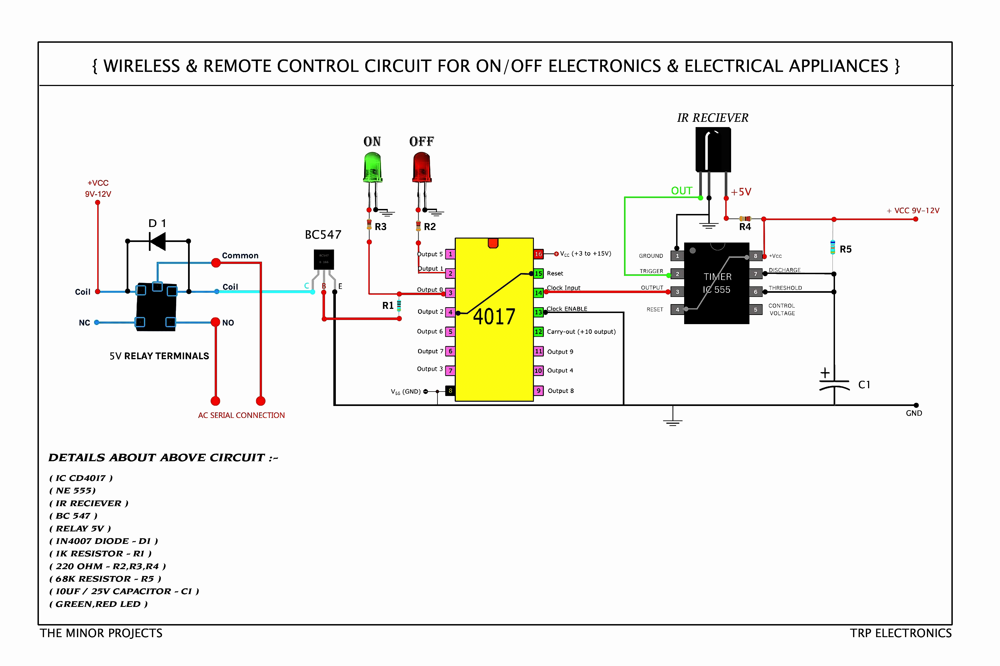
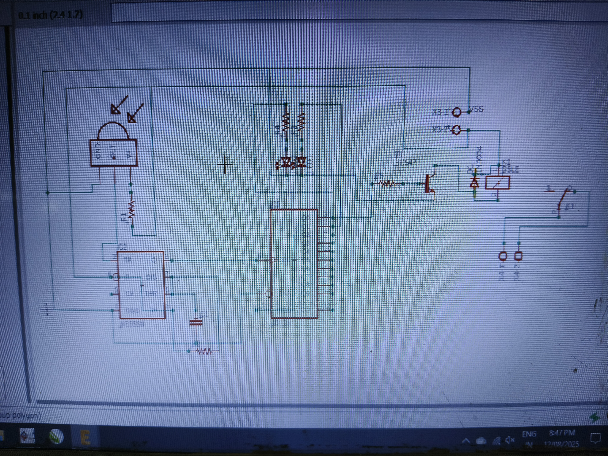
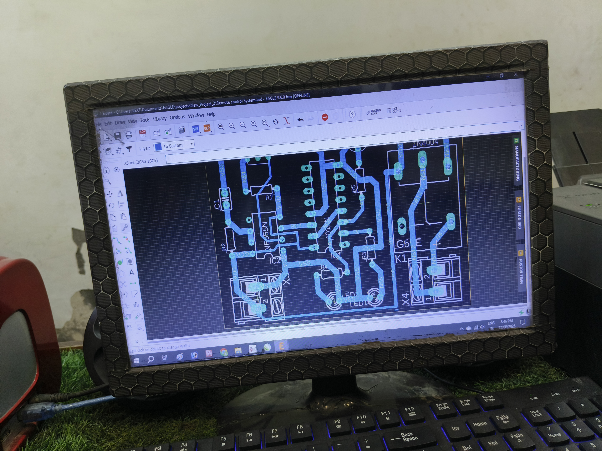

# Wireless & Remote Control Circuit for Home Appliances 🛠️📡

This project showcases a hardware-based wireless remote control system designed to toggle electrical and electronic appliances ON and OFF using any standard IR remote. It is highly useful for home automation and assists in controlling high-voltage AC appliances safely from a distance.

## 🚀 Key Features
- **Wireless Toggling:** Switch appliances ON/OFF with a remote control.
- **Relay Isolation:** Uses a 5V relay to safely handle AC serial connections.
- **Visual Indicators:** Dedicated LEDs to indicate current ON/OFF status.
- **No Microcontroller Required:** Purely built using robust hardware ICs (555 Timer & 4017 Counter).

## 📊 Schematic & Circuit Diagram
 

## 🧱 Component Details & Specifications
The circuit is built using the following components:
- **ICs:** CD4017 Decade Counter, NE555 Timer
- **Sensors & Switches:** IR Receiver TSOP
- **Transistor:** BC547 NPN (used as a switch for the relay)
- **Relay:** 5V Relay Terminals (with 1N4007 Flyback Diode)
- **Resistors:** 1kΩ (R1), 220Ω (R2, R3, R4), 68kΩ (R5)
- **Capacitors:** 10µF / 25V Electrolytic Capacitor (C1)
- **Indicators:** Green LED (ON state), Red LED (OFF state)

## ⚙️ Working Principle
1. **Signal Demodulation:** The IR Receiver detects the remote's pulse and sends a low signal output.
2. **Pulse Shaping:** The NE555 Timer (configured in monostable/astable mode) processes the trigger to give a clean clock pulse.
3. **State Toggling:** The CD4017 Decade Counter receives the clock pulse at Pin 14 and toggles its output states between Pin 2 and Pin 3.
4. **Load Switching:** The BC547 transistor amplifies the signal to energize the 5V relay coil, safely completing the AC Serial Connection.
---
🔗 PCB Designs: [PDF 1](Files/pdf_1.pdf)

🔗 PCB Designs: [PDF 2](Files/Remote_control_System_Bottum[1].pdf)

---
## 📌 Process

---
Developed under **TRP Electronics** | The Minor Projects
